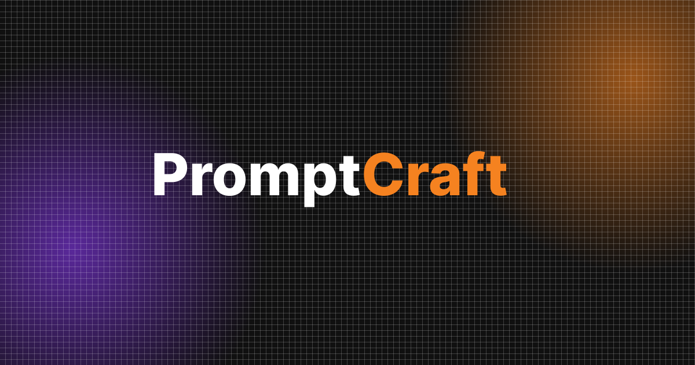

# PromptCraft - Professional AI Prompt Studio

**PromptCraft** is an advanced prompt engineering tool designed to help creators, developers, and researchers generate high-quality, optimized prompts for various AI models. Built with a focus on bilingual support (English/Vietnamese) and a premium user experience.



## 🚀 Key Features

*   **Bilingual Intelligence**: Automatically generates prompts in **English** (optimized for AI models like Midjourney, Stable Diffusion, GPT-4) and provides a **Vietnamese** translation for user understanding.
*   **Multi-Domain Support**: Specialized modes for:
    *   **Research**: Deep dive topics, summarize papers, and structure complex queries.
    *   **Image Generation**: Crafted styles, lighting, and camera settings for generative art.
    *   **Video**: Scripts, storyboards, and scene descriptions.
    *   **Outline**: Structural planning for essays, blogs, and reports.
    *   **Music**: Composition details, instruments, and mood settings.
*   **Smart History**: Automatically saves your generations locally. Search, filter, and revisit your past ideas instantly.
*   **Premium UI/UX**:
    *   **Glassmorphism Design**: Modern, clean aesthetic with transparency effects.
    *   **Light/Dark Mode**: Fully responsive theming with optimized contrast for all lighting conditions.
    *   **Mobile Optimized**: Native-app feel on mobile devices with PWA support.
*   **Safety & Privacy**: Built on Google's Gemini Flash, ensuring high speed and safe content filtering.

## 🛠 Tech Stack

*   **Frontend**: [React 19](https://react.dev/), [Vite](https://vitejs.dev/)
*   **Styling**: [Tailwind CSS](https://tailwindcss.com/)
*   **AI Engine**: [Google Generative AI SDK](https://www.npmjs.com/package/@google/genai) (Gemini Models)
*   **Storage**: IndexedDB (via `idb`) for local history persistence.
*   **Icons**: Material Symbols Rounded.

## 🚦 Getting Started

Follow these steps to run the project locally.

### Prerequisites

*   Node.js (v18 or higher)
*   npm or yarn

### Installation

1.  **Clone the repository**
    ```bash
    git clone https://github.com/zeusato/PromptCraft.git
    cd promptcraft-vn
    ```

2.  **Install dependencies**
    ```bash
    npm install
    ```

3.  **Configure Environment**
    Create a `.env` or `.env.local` file in the root directory and add your Google Gemini API Key:
    ```env
    VITE_GEMINI_API_KEY=your_api_key_here
    ```

4.  **Run Development Server**
    ```bash
    npm run dev
    ```

    The app will start at `http://localhost:5173`.

## 📱 Build for Production

To create a production-ready build:

```bash
npm run build
```

## 📄 License

This project is licensed under the MIT License.

---
*Created by [Quyetnm](https://github.com/zeusato)*
